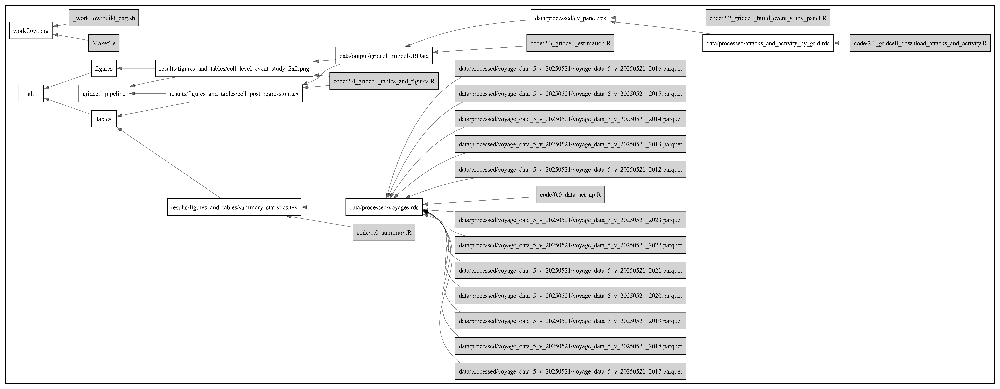

# piracy-shipping

A draft working copy of the manuscript can be found here: [The Economic and Environmental Impact of Modern Piracy on Global Shipping](https://renatomolinah.com/assets/docs/piracy.pdf).

# Reproducibility  

## Package management  

To manage package dependencies, we use the `renv` package. When you first clone this repo onto your machine, run `renv::restore()` to ensure you have all correct package versions installed in the project. Please see the [renv website](https://rstudio.github.io/renv/articles/renv.html) for more information.

## Data processing and analysis pipeline

To ensure reproducibility in the data processing and analysis pipeline, we use the `targets` package. Targets is a Make-like pipeline tool. Using targets means that anytime an upstream change is made to the data or models, all downstream components of the data processing and analysis will be re-run automatically when the `targets::tar_make()` command is run. It also means that once components of the analysis have already been run and are up-to-date, they will not need to be re-run. All objects are cached in a `_targets` directory. Please see the [targets website](https://github.com/ropensci/targets) for more information.

For targets to function correctly, the user only needs to make one change to update the cache directory by running the command `targets::tar_config_set(store = ...)`, where `...` is the `piracy/data/_targets` data directory in the emLab Shared Google Drive on your personal machine. For example, on Gavin's machine, he runs `targets::tar_config_set(store = "/Users/gmcdonald/Library/CloudStorage/GoogleDrive-gmcdonald@ucsb.edu/Shared\ drives/emlab/Projects/current-projects/piracy/data/_targets")`. Setting this data directory will also provide the necessary pointer to the raw data, which are also current stored on the Shared Drive.

Once this has been done, you can simply run `targets::tar_make()` to reproduce the full data processing and analysis pipeline. 

In order to see what the targets pipeline looks like, you can run `targets::tar_manifest()` or `targets::tar_visnetwork()`, which also shows which targets are current or out-of-date. In overview, the pipeline:

1. Processes the raw piracy attack, wind, and fuel data in R. Note that these raw data are currently stored on the emLab Shared Drive. The wind data in particular are too large for GitHub. We may eventually need to figure out a different place to store these.    
2. Using those processed data, GFW queries are performed in Google BigQuery to generated ungridded, gridded, and voyage-level versions of the dataset with all necessary piracy attack, wind, and fuel columns. There are a number of queries which store interim versions of the dataset on BigQuery (e.g., `gridded_data_0_5`, which will be used for the gridded analysis). Interim datasets are stored in the emLab BigQuery dataset `emlab-gcp.piracy`. Several datasets are then pulled locally, including the voyage-level version of the dataset (`voyage_data`, which is very very large). Note that this step requires special permissions to acces the GFW data on Google BigQuery. I've included this in the pipeline for now, but we may eventually need to somehow take this out of the pipeline so that the analysis can be fully reproducible by others.  
3. Performs analyses on those data.  
4. Generates final figures and tables.  

## Makefile

The Make-based pipeline mirrors the structure of the analysis scripts. The DAG below summarizes the dependencies between data, code, and outputs:



# Repository Structure 

```
piracy-shipping
  |__ code           # Numbered analysis scripts (0.x → 4.x); run in order
  |__ r              # Helper functions and data-processing utilities
  |__ sql            # BigQuery SQL for voyage and grid-cell datasets
  |__ _workflow      # Make DAG generation helpers
  |__ figures        # Static figures used in the manuscript
  |__ results        # Generated figures and tables
  |__ renv           # renv package management
  |__ data           # Local data store (gitignored; symlinked to Box)
```

The `code/` directory uses a numbered naming convention indicating execution order:

- `0.x` — data setup
- `1.x` — summary statistics
- `2.x` — grid-cell analysis (event study, did_multiplegt_dyn)
- `3.x` — voyage-level main estimation and robustness
- `4.x` — cost and emissions regressions, counterfactual maps and tables
